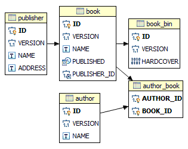
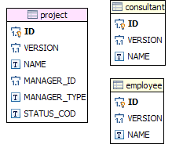

goSQL
=====

a ORM like library in Go (golang) that makes SQL easier to use.

## Index

* [Introduction](#introduction)
* [Features](#features)
* [Tested Databases](#tested-databases)
* [Dependencies](#dependencies)
* [Instalation](#instalation)
* [Startup Guide](#startup-guide)
* [Usage](#usage)
* [Entity Relation Diagram](#entity-relation-diagram)
* [Table definition](#table-definition)
* [Transactions](#transactions)
* [Insert Examples](#insert-examples)
	* [Simple Insert](#simple-insert)
	* [Insert With a Struct](#insert-with-a-struct)
	* [Insert Returning Generated Key](#insert-returning-generated-key)
* [Update Examples](#update-examples)
	* [Update selected columns with Optimistic lock](#update-selected-columns-with-optimistic-lock)
	* [Update with struct](#update-with-struct)
	* [Update with SubQuery](#update-with-subQuery)
* [Delete Examples](#delete-examples)
	* [Simple Delete](#simple-delete)
	* [Delete with struct](#delete-with-struct)
* [Query Examples](#query-examples)
	* [SelectInto](#selectinto)
	* [SelectTo](#selectto)
	* [SelectTree](#selectTree)
	* [SelectFlatTree](#selectflattree)
	* [ListSimple](#listsimple)
	* [ListInto](#listinto)
	* [List](#list)
	* [ListOf](#listof)
	* [ListFlatTree](#listflattree)
	* [ListTreeOf](#listtreeof)
	* [Column Subquery](#column-subquery)
	* [Where Subquery](#where-subquery)
	* [Joins](#joins)
	* [Group By](#group-by)
	* [Having](#having)
	* [Order By](#order-by)
	* [Union](#union)
	* [Pagination](#pagination)
* [Struct Triggers](#struct-triggers)
* [Table Triggers](#table-triggers)
* [Association Discriminator](#association-discriminator)
* [Table Discriminator](#table-discriminator)
* [Custom Functions](#custom-functions)
* [Native SQL](#native-sql)

## Introduction

(English is not my native language so please bear with me)

**goSQL** aims to facilitate the convertion between database tables and structs and make easy
the use of complex joins.
It has no intention of hiding the SQL from the developer and a closer idiom to SQL is also part of the library.
Structs can be used as a representation of a table record for CRUD operations but there is no direct dependency between a struct and a table. The fields of a struct are matched with the column alias of the SQL statement to build a result.

This library is not locked to any database vendor. This database abstraction is achieved by what I called _Translators_. Translators for MySQL, PostgreSQL, FirebirdSQL and Oracle are provided.
These Translators can be extended  by registering functions to implement functionality not covered by the initial Translators or customize to something specific to a project.

This library is supported by a mapping system that enables you to avoid writing any SQL text.
References to your database schema are located in one place, avoiding a major pain when you have to refactor your database.

An example of the syntax is as follows:

```go
var publisher = Publisher{}
store.Query(PUBLISHER).
	All().
	Where(PUBLISHER_C_ID.Matches(2)).
	SelectTo(&publisher)
```

Short version

```go
store.Retrive(&publisher, 2)
```

We are not restricted to the use of structs as demonstrated by the next snippet

```go
var name *string
store.Query(PUBLISHER).
	Column(PUBLISHER_C_NAME).
	Where(PUBLISHER_C_ID.Matches(2)).
	SelectInto(&name)
```

Another example with an update

```go
store.Update(PUBLISHER).Submit(&publisher)
```

and the shorter version...

```go
store.Modify(&publisher)
```

## Features

 - SQL DSL
 - Simple join declaration
 - Populate struct tree with query results containing joins
 - Automatic setting of primary keys for inserts
 - Automatic version increment
 - Database Abstraction
 - Transactions
 - Optimistic Locking
 - Result Pagination
 - Quick CRUD actions
 - Pre/Post insert/update/delete Struct triggers
 - Support for primitive pointer types like `*string`, `*int64`, `*float64`, `*bool`, etc
 - Support for types implementing `driver.Valuer` and `sql.Scanner` interface, like NullString, etc
 - Extensible

## Tested Databases
 - MariaDB 5.5
 - PostgreSQL 9.2
 - FirebirdSQL 2.5
 - Oracle XE 11g

## Dependencies
go 1.1+

## Installation
`go get github.com/quintans/toolkit`

`go get github.com/quintans/goSQL`


## Startup Guide
This guide is based on a MySQL database, so we need to get a database driver.
I used the one in https://github.com/go-sql-driver/mysql

So lets get started.

Create the table `PUBLISHER` in a MySQL database called `goSQL`.
Of course the database name can be changed and configured to something else.

```sql
CREATE TABLE `PUBLISHER` (
	ID BIGINT NOT NULL AUTO_INCREMENT,
	VERSION INTEGER NOT NULL,
	`NAME` VARCHAR(50),
	`ADDRESS` VARCHAR(255),
	PRIMARY KEY(ID)
)
ENGINE=InnoDB
DEFAULT CHARSET=utf8;
```

And the code is

```go
import (
	. "github.com/quintans/goSQL/db"
	"github.com/quintans/goSQL/dbx"
	trx "github.com/quintans/goSQL/translators"

	_ "github.com/go-sql-driver/mysql"

	"database/sql"
	"fmt"
)

// the entity
type Publisher struct {
	Id      *int64
	Version *int64
	Name    *string
}

// table description/mapping
var (
	PUBLISHER           = TABLE("PUBLISHER")
	PUBLISHER_C_ID      = PUBLISHER.KEY("ID")          // implicit map to field Id
	PUBLISHER_C_VERSION = PUBLISHER.VERSION("VERSION") // implicit map to field Version
	PUBLISHER_C_NAME    = PUBLISHER.COLUMN("NAME")     // implicit map to field Name
)

// the transaction manager
var TM ITransactionManager

func init() {
	// database configuration
	mydb, err := sql.Open("mysql", "root:root@/goSQL?parseTime=true")
	if err != nil {
		panic(err)
	}

	translator := trx.NewMySQL5Translator()

	// transaction manager
	TM = NewTransactionManager(
		// database
		mydb,
		// database context factory
		func(inTx *bool, c dbx.IConnection) IDb {
			return NewDb(inTx, c, translator)
		},
		// statement cache
		1000,
	)
}

func main() {
	// get the databse context
	store := TM.Store()
	// the target entity
	var publisher = Publisher{}

	_, err := store.Query(PUBLISHER).
		All().
		Where(PUBLISHER_C_ID.Matches(2)).
		SelectTo(&publisher)

	if err != nil {
		panic(err)
	}

	fmt.Printf("%s", publisher)
}
```

Something like this is what you will find in [common.go](test/common/common.go).

## Usage
In this chapter I will try to explain the several aspects of the library using a set of examples.
These examples are supported by tables defined in [tables_mysql.sql](test/mysql/tables_mysql.sql), a MySQL database sql script.

Before diving in to the examples I first describe the table model and how to map the entities.

### Entity Relation Diagram


Relationships explained:
- **One-to-Many**: One Publisher can have many Books and one Book has one Publisher.
- **One-to-One**: One Book has one Book_Bin (Hardcover) - binary data is stored in a separated table - and one Book_Bin has one Book.
- **Many-to-Many**: One Author can have many Books and one Book can have many Authors


### Table definition

As seen in the [Startup Guide](#startup-guide), mapping a table is pretty straight forward.

**Declaring a table**

```go
var PUBLISHER = TABLE("PUBLISHER")
```

**Declaring a column**

```go
var PUBLISHER_C_NAME = PUBLISHER.COLUMN("NAME")     // implicit map to field 'Name''
```

By default, the result value for this column will be put in the field `Name` of the target struct.
If we wish for a different alias we use the `.As("...")` at the end resulting in:

```go
var PUBLISHER_C_NAME = PUBLISHER.COLUMN("NAME").As("Other") // map to field 'Other'
```

The declared alias `Other` is now the default for all the generated SQL.
As all defaults, it can be changed to another value when building a SQL statement.

Besides the regular columns, there are the special columns `KEY`, `VERSION` and `DELETION`.

```go
var PUBLISHER_C_ID       = PUBLISHER.KEY("ID")           // implicit map to field Id
var PUBLISHER_C_VERSION  = PUBLISHER.VERSION("VERSION")  // implicit map to field Version
var PUBLISHER_C_DELETION = PUBLISHER.DELETION("DELETION") // map to field 'Deletion'
```

- `KEY` identifies the column or columns as primary key of a table.
- `VERSION` identifies the column used for optimistic locking.
- `DELETION` identifies the column used for logic record deletion.

It is not mandatory to map all columns of a table. For the same physical table several logical tables can be created with diferent set of columns. They can even refer to diferent domain values depending on a discriminator column as seen in the [Table Discriminator](#table-discriminator) section.

Next we will see how to declare associations. To map associations, we do not think on
the multiplicity of the edges, but how to go from A to B. This leaves us only two types of associations:
Simple (one-to-one, one-to-many, many-to-one) and Composite (many-to-many) associations.
How to use associations is explained in the [Query](#query-examples) chapter.

**Declaring a Simple association**

```go
var PUBLISHER_A_BOOKS = PUBLISHER.
			ASSOCIATE(PUBLISHER_C_ID).
			TO(BOOK_C_PUBLISHER_ID).
			As("Books")
```

In this example, we see the mapping of the relationship between
`PUBLISHER` and `BOOK` using the column `PUBLISHER_C_ID` and `BOOK_C_PUBLISHER_ID`.
The `.As("Books")` part indicates that when transforming a query result to a struct, it should follow
the `Books` field to put the transformation part regarding to the `BOOK` entity.
The Association knows nothing about the multiplicity of its edges.
This association only covers going from `PUBLISHER` to `BOOK`. If we want to go from `BOOK` to `PUBLISHER` we
need to declare the reverse association.

**Declaring a Composite association.**

This kind of associations makes use on an intermediary table, and therefore we need to declare it.

```go
var (
	AUTHOR_BOOK				= TABLE("AUTHOR_BOOK")
	AUTHOR_BOOK_C_AUTHOR_ID	= AUTHOR_BOOK.KEY("AUTHOR_ID") // implicit map to field 'AuthorId'
	AUTHOR_BOOK_C_BOOK_ID	= AUTHOR_BOOK.KEY("BOOK_ID") // implicit map to field 'BookId'
)
```

And finally the Composite association declaration

```go
var AUTHOR_A_BOOKS = NewM2MAssociation(
	"Books",
	ASSOCIATE(AUTHOR_C_ID).WITH(AUTHOR_BOOK_C_AUTHOR_ID),
	ASSOCIATE(AUTHOR_BOOK_C_BOOK_ID).WITH(BOOK_C_ID),
)
```

The order of the parameters is very important, because they indicate the direction of the association.

The full definition of the tables and the struct entities used in this document are in [entities.go](test/common/entities.go), covering all aspects of table mapping.


### Transactions

To wrap operations inside a transaction we do this:

```go
TM.Transaction(func(store IDb) error {
	// put you actions here
});
```

If an error is returned or panic occurs, the transaction is rolled back, otherwise is commited.

[common.go](test/common/common.go) has several examples of transactions.


### Insert Examples

#### Simple Insert

```go
insert := Insert(PUBLISHER).
	Columns(PUBLISHER_C_ID, PUBLISHER_C_VERSION, PUBLISHER_C_NAME)
insert.Values(1, 1, "Geek Publications").Execute()
insert.Values(2, 1, "Edições Lusas").Execute()
```

There is another way of supplying values, for all CRUD operations, and this is by parameter,
as seen in the following snippet.

```go
insert.SetParameter("name", "Geek Publications")
insert.Values(1, 1, Param("name")).Execute()
```

In this example the value for the `name` parameter is directly supplied in the snippet but it could be an "environment" variable supplied by a custom `store` for every CRUD operation.
One example, could be `language` (pt, eng, ...) for internationalized text, or `channel` (web, mobile, ...) for descriptions, etc.


#### Insert With a Struct

When inserting with a struct, the struct fields are matched with the respective columns.

```go
var pub Publisher
pub.Name = ext.StrPtr("Untited Editors")
store.Insert(PUBLISHER).Submit(&pub) // passing as a pointer
```

A shorter version would be

```go
store.Create(&pub)
```

but this implies that the table was registered with the same alias as the struct name. In this case is `Publisher`.

In both cases the values of the Id and Version fields of the struct are also set if present.


#### Insert Returning Generated Key
Any of the above snippets, if the Id field/column is undefined (0 or nil) it returns the generated key by the database.

```go
key, _ := store.Insert(PUBLISHER).
	Columns(PUBLISHER_C_ID, PUBLISHER_C_VERSION, PUBLISHER_C_NAME).
	Values(nil, 1, "New Editions").
	Execute()
```

> **Key fields can be as many as we want. If a key field is of the type (*)int64 and single, it is considered to be a auto generated key.**


### Update Examples

#### Update selected columns with Optimistic lock

```go
store.Update(PUBLISHER).
	Set(PUBLISHER_C_NAME, "Untited Editors"). // column to update
	Set(PUBLISHER_C_VERSION, version + 1).    // increment version
	Where(
	PUBLISHER_C_ID.Matches(1),
	PUBLISHER_C_VERSION.Matches(version),     // old version
).Execute()
```


#### Update with struct

When updating with a struct, the struct fields are matched with the respective columns.
If a version column is present its value is also updated.
The generated SQL will include all columns.

```go
var publisher Publisher
publisher.Name = ext.StrPtr("Untited Editors")
publisher.Id = ext.Int64Ptr(1)      // identifies the record
publisher.Version = ext.Int64Ptr(1) // for optimistic locking
store.Update(PUBLISHER).Submit(&publisher) // passing as a pointer
```

A shorter version would be

```go
store.Modify(&publisher)
```

There is also another interesting method that does a Insert or an Update, depending on the value of the version field.
If the field version is zero or nil an insert is issued, otherwise is an update.

```go
store.Save(&publisher)
```

> Assumes that the table `PUBLISHER` was registered with the name `Publisher`.


#### Update with SubQuery

This example shows the use of a subquery to do an update, and also the use of `Exists`.

```go
sub := store.Query(BOOK).Alias("b").
	Column(AsIs(nil)).
	Where(
	BOOK_C_PUBLISHER_ID.Matches(Col(BOOK_C_ID).For("a")),
	BOOK_C_PRICE.Greater(10),
)

store.Update(PUBLISHER).Alias("a").
	Set(PUBLISHER_C_NAME, Upper(PUBLISHER_C_NAME)).
	Where(Exists(sub)).
	Execute()
```

### Delete Examples

#### Simple Delete

```go
store.Delete(BOOK).Where(BOOK_C_ID.Matches(2)).Execute()
```

As we can see the Version column is not taken into account.


#### Delete with struct

```go
var book Book
book.Id = ext.Int64Ptr(2)
book.Version = ext.Int64Ptr(1)
store.Delete(BOOK).Submit(book)
```

Althougt we are using `Book` to execute the delete, any struct with a fields named `Id` could be used. `Version` could also be present.

Shorter Version for the last instruction:

```go
store.Remove(book)
```

> Assumes that the table `BOOK` was registered with the name `Book`.

When deleting with a struct, the presence of a key field is mandatory.


### Query Examples

The query operation is by far the richest operation of the ones we have seen.
Query operation that start with `Select*` retrive **one** instance, and those that start with `List*` returns **many** instances.


#### SelectInto

The result of the query is put in the supplied variables. They must be a pointers.

```go
var name string
store.Query(PUBLISHER).
	Column(PUBLISHER_C_NAME).
	Where(PUBLISHER_C_ID.Matches(2)).
	SelectInto(&name)
```


#### SelectTo

The result of the query is put in the supplied struct pointer.

```go
var publisher Publisher
store.Query(PUBLISHER).
	All().
	Where(PUBLISHER_C_ID.Matches(2)).
	SelectTo(&publisher)
```

The short version, that internally uses the previous query, is:

```go
store.Retrive(&publisher, 2)
```

> Assumes that the table `PUBLISHER` was registered with the name `Publisher`.

The supplied keys must be in the same order as they were declared in the table definition.


#### SelectTree

Executes the query and builds a struct tree, reusing previously obtained entities,
putting the first element in the supplied struct pointer.
When a new entity is needed, the cache is checked to see if there is one instance for this entity,
and if found it will use it instead.
Since the struct instances are going to be reused it is mandatory that all the structs
participating in the result tree implement the `toolkit.Hasher` interface.
Returns true if a result was found, false otherwise.

```go
var publisher Publisher
store.Query(PUBLISHER).
	All().
	Outer(PUBLISHER_A_BOOKS).
	Fetch(). // add all columns off Book in the query
	Where(PUBLISHER_C_ID.Matches(2)).
	SelectTree(&publisher)
```

#### SelectFlatTree

Executes the query and builds a flat struct tree putting the first element in the supplied struct pointer.

> A flat tree means that one entity will have at most one child, even if related by a one-to-many association.
Ex: 1 publisher -> 1 book -> 1 author

Each element of the tree is always a new instance even if representing the same entity.
This is most useful to display results in a table.
Since the struct instances are not going to be reused it is not mandatory that the structs implement the `toolkit.Hasher` interface.
Returns true if a result was found, false otherwise.

```go
var publisher Publisher
store.Query(PUBLISHER).
	All().
	Outer(PUBLISHER_A_BOOKS).
	Fetch(). // add all columns off Book in the query
	Where(PUBLISHER_C_ID.Matches(2)).
	SelectFlatTree(&publisher)
```


#### ListSimple

Lists simple variables using a closure to assemble the result list.
The types for scanning are supplied by the instances parameter.

```go
names := make([]string, 0)
var name string
store.Query(PUBLISHER).
	Column(PUBLISHER_C_NAME).
	ListSimple(func() {
	names = append(names, name)
}, &name)
```


#### ListInto

This method is very similar to the previous one, but relies on reflection.
A function is used to build the result list. The types for row scanning are supplied by the function parameters.
The parameters can be pointers or not.
The function can be declared with a return value.
This is useful if a returning struct needs to be preprocessed.

```go
names := store.Query(PUBLISHER).
	Column(PUBLISHER_C_NAME).
	ListInto(func(name *string) string {
		return *name;
})
```

[Union](#union) has an example of result processing.

We can also use a function accepting a struct, returning or not another struct, to do some processing as shown below.

```go
books := make([]*Book, 0)
store.Query(BOOK).
	All().
	ListInto(func(book *Book) {
	books = append(books, book)
})
```

 The target entity is determined by the receiving type of the function.


#### List

Executes a query, putting the result in the slice, passed as an argument.

```go
var books []Book  // []*Book is also valid
store.Query(BOOK).
	All().
	List(&books)
```


#### ListOf

Another way of executing the above query would be

```go
store.Query(BOOK).
	All().
	ListOf((*Book)(nil))
```

ListOf returns a `collection.Collection` interface. There are cases where we might wish to work with a generic list. Later on we will see another use for this new data type.

To traverse the results we use the following code

```go
for e := books.Enumerator(); e.HasNext(); {
	book := e.Next().(*Book)
	// do something
}
```


#### ListFlatTree

Executes a query, putting the result in the slice, passed as an argument.

```go
var publishers []*Publisher
store.Query(PUBLISHER).
	All().
	Outer(PUBLISHER_A_BOOKS).
	Fetch(). // add all columns off book in the query
	Where(PUBLISHER_C_ID.Matches(2)).
	ListFlatTree(&publishers)
```

The slice only contains the head of the tree.
A new instance is created for every returned row.
This useful if we wish to return a tabular result to use in tables, whithout having to create a struct specificaly for that purpose.

The same can be achieved by the following code.

```go
publishers := make([]*Publisher, 0)
store.Query(PUBLISHER).
	All().
	Outer(PUBLISHER_A_BOOKS).
	Fetch(). // add all columns off book in the query
	Where(PUBLISHER_C_ID.Matches(2)).
	ListFlatTree(func(publisher *Publisher) {
	publishers = append(publishers, publisher)
})
```

This is useful if we would like to do aditional logic, when building the array.
The responsability of building the result is delegated to the receiving function.
[Union](#union) has an example of result processing.

There is another query function named `ListFlatTreeOf` with the same behaviour as `ListFlatTree` but returns a collection.


#### ListTreeOf

Executes a query and transform the results into a tree with the head with the passed struct type.
It matches the result column alias with the struct field name, building a struct tree.

When creating the result, previouly fetched entities will be searched and reused if found. A search in a hash collection is faster than search in a slice and that is why a hash that implements the `collection.Collection`interface is returned instead of the classic slice.
For a struct to be used in a  hash, the struct must implement the `toolkit.Hasher` interface, as is the case of `Book`.

```go
publishers, _ := store.Query(PUBLISHER).
	All().
	Outer(PUBLISHER_A_BOOKS).
	Fetch(). // add all columns off book in the query
	Where(PUBLISHER_C_ID.Matches(2)).
	ListTreeOf((*Publisher)(nil))

for e := publishers.Enumerator(); e.HasNext(); {
	publisher := e.Next().(*Publisher)
	// do something here
}
```


#### Column Subquery

For this example we will use the following struct which will hold the result for each row.

```go
type Dto struct {
	Name      string
	OtherName string
	Value     float64
}
```

> The struct does not represent any table.

The following query gets the name of the publisher and the sum of the prices of books for each publisher (using a subquery to sum), building the result as a slice of `Dto`.

```go
subquery := store.Query(BOOK).Alias("b").
	Column(Sum(BOOK_C_PRICE)).
	Where(
	BOOK_C_PUBLISHER_ID.Matches(Col(PUBLISHER_C_ID).For("p")),
)

var dtos []*Dto
store.Query(PUBLISHER).Alias("p").
	Column(PUBLISHER_C_NAME).
	Column(subquery).As("Value").
	List(&dtos)
```

Notice that when I use the subquery variable an alias `"Value"` is defined. This alias matches with a struct field in `Dto`. In this query the `PUBLISHER_C_NAME` column as no associated alias, so the default column alias is used.


#### Where Subquery

In this example I get a list of records with the name of the `Publisher`, the name and price of every `Book`, where the price is lesser or equal than 10. The result is put in a slice of `Dto` instances.
For this a subquery is used in the where clause.

```go
subquery := store.Query(BOOK).
	Distinct().
	Column(BOOK_C_PUBLISHER_ID).
	Where(
	BOOK_C_PRICE.LesserOrMatch(10),
)

var dtos []*Dto
store.Query(PUBLISHER).
	Column(PUBLISHER_C_NAME).
	Inner(PUBLISHER_A_BOOKS).
	Include(BOOK_C_NAME).As("OtherName").
	Include(BOOK_C_PRICE).As("Value").
	Join().
	Where(PUBLISHER_C_ID.In(subquery)).
	List(&dtos)
```

#### Joins

The concepts of joins was already introduced in the section [SelectTree](#selectTree) where we can see the use of an outer join.
In the context of goSQL, a Join is seen has a path of associations that goes from the main table to the target table. Along the way we can apply constraints and/or include columns from the participating tables. These paths can overlap without problem because they are seen as isolated from one another.
When declaring several paths only when a path deviates from previous path it starts contributing to the SQL generation.
Joins can be `Outer` or `Inner` and can have constraints applyied to the target table of the last added asscoiation through the use of the function `On()`.
To mark the end of a join definition we use the function `Join()` or `Fetch()`. Both process the join but the later includes in the query all columns from all the tables of the joins. `Fetch()` is used when a struct tree is desired.

Ex: list all publishers that had a book published before 2013

```go
var publishers []*Publisher
store.Query(PUBLISHER).
	All().
	Distinct().
	Inner(PUBLISHER_A_BOOKS).
	On(BOOK_C_PUBLISHED.Lesser(time.Date(2013, time.January, 1, 0, 0, 0, 0, time.UTC))).
	Join().
	List(&publishers)
```

The section [Where Subquery](#where-subquery) also shows the use of `Include`.

The next example executes a (left) outer join and includes **ALL** columns of the participating tables in the join. The result is a collection of `*Publisher` structs with its childs in tree.

```go
store.Query(PUBLISHER).
	All().
	Outer(PUBLISHER_A_BOOKS, BOOK_A_AUTHORS).
	Fetch().
	ListTreeOf((*Publisher)(nil))
```


#### Group By

For this example I will use the struct defined in [Column Subquery](#column-subquery).

```go
var dtos []*Dto
store.Query(PUBLISHER).
	Column(PUBLISHER_C_NAME).
	Outer(PUBLISHER_A_BOOKS).
	Include(Sum(BOOK_C_PRICE)).As("Value").
	Join().
	GroupByPos(1). // result column position
	List(&dtos)
```


#### Having

The criteria used in the `Having` clause must refer to columns of the `Query`. This reference is achieved using columns alias.
To demonstrate this I will use the following struct which will hold the result for each row.

```go
type PublisherSales struct {
	Name         string
	ThisYear     float64
	PreviousYear float64
}
```

> Struct fields can also be non pointers

```go
var sales []*PublisherSales
store.Query(PUBLISHER).
	Column(PUBLISHER_C_NAME).
	Outer(PUBLISHER_A_BOOKS).
	Include(Sum(BOOK_C_PRICE)).As("ThisYear").
	Join().
	GroupByPos(1).
	Having(Alias("ThisYear").Greater(30)).
	List(&sales)
```


#### Order By

List all publishers, ordering ascending by name.

```go
var publishers []*Publisher
store.Query(PUBLISHER).
	All().
	OrderBy(PUBLISHER_C_NAME). // implicit ascending
	List(&publishers)
```

It is possible to add more orders, and even to order by columns belonging to other tables if joins were present, as seen below.

```go
store.Query(PUBLISHER).
		All().
		Order(PUBLISHER_C_ID).
		Outer(PUBLISHER_A_BOOKS).OrderBy(BOOK_C_ID). // order a column belonging to BOOK
		Outer(BOOK_A_AUTHORS).OrderBy(AUTHOR_C_ID).Desc(). // order a column belonging to AUTHOR
		Fetch(). // this marks the end of the branch and that the results should populate a struct tree
		ListTreeOf((*Publisher)(nil))
```

The column that the `OrderBy` refers to, belongs to the table targeted by the last defined association.

If there is no declared association, the column belongs to the driving table, as seen in the first example.

There is also `Order` if we want to order by a column belonging to the driving table.


#### Union

This example list all `Publishers` and shows side by side the sales of this year and the previous year.
The function used in `List` is responsible for agregating the result.

```go
sales := make([]*PublisherSales, 0)
store.Query(PUBLISHER).
	Column(PUBLISHER_C_ID).
	Column(PUBLISHER_C_NAME).
	Outer(PUBLISHER_A_BOOKS).
	Include(Sum(Coalesce(BOOK_C_PRICE, 0))).As("ThisYear").
	On(
	Range(
		BOOK_C_PUBLISHED,
		time.Date(2013, time.January, 01, 0, 0, 0, 0, time.UTC),
		time.Date(2013, time.December, 31, 23, 59, 59, 1e9-1, time.UTC),
	),
).
	Join().
	Column(AsIs(0)).As("PreviousYear").
	GroupByPos(1).
	UnionAll(
	store.Query(PUBLISHER).Alias("u").
		Column(PUBLISHER_C_ID).
		Column(PUBLISHER_C_NAME).
		Outer(PUBLISHER_A_BOOKS).
		Column(AsIs(0)).As("ThisYear").
		Include(Sum(Coalesce(BOOK_C_PRICE, 0))).As("PreviousYear").
		On(
		Range(
			BOOK_C_PUBLISHED,
			time.Date(2012, time.January, 01, 0, 0, 0, 0, time.UTC),
			time.Date(2012, time.December, 31, 23, 59, 59, 1e9-1, time.UTC),
		),
	).
		Join().
		GroupByPos(1),
).
	List(func(sale *PublisherSales) {
	found := false
	for _, v := range sales {
		if sale.Id == v.Id {
			v.ThisYear += sale.ThisYear
			v.PreviousYear += sale.PreviousYear
			found = true
			break
		}
	}
	if !found {
		sales = append(sales, sale)
	}
})
```

> The alias in the second query is necessary to avoid overlaping replaced parameters between the two queries

#### Pagination

To paginate the results of a query we use the windowing functions `Skip` and `Limit`.

```go
var publishers []*Publisher
store.Query(PUBLISHER).
	All().
	Outer(PUBLISHER_A_BOOKS, BOOK_A_AUTHORS).
	Fetch().
	Order(PUBLISHER_C_NAME).  // implicit ascending
	Skip(2).  // skip the first 2 records
	Limit(3). // limit to 3 records
	ListFlatTree(&publishers)
```

### Struct Triggers

It is possible to define methods that are called before/after an insert/update/delete/query to the database.

For example, defining the following method will trigger a call for every struct before a insert.

```go
PreInsert(store IDb) error
```

The same can be done for binding a trigger after an insert using the following signature.

```go
PostInsert(store IDb)
```

The remaining triggers are:

```go
PreUpdate(store IDb) error
PostUpdate(store IDb)
PreDelete(store IDb) error
PostDelete(store IDb)
PostRetrive(store IDb)
```

If an error is returned in a Pre trigger the action is not performed.

To know if a trigger is called inside a transaction use `store.InTransaction()`.


### Table Triggers

It is also possible to declare triggers/hooks in the table declaration.

Auditing example:

```go
func init() {
	// pre insert trigger
	BOOK.PreInsertTrigger = func(ins *db.Insert) {
		ins.Set(BOOK_C_VERSION, 1)
		ins.Set(BOOK_C_CREATION, ext.NOW())
		uid, ok := ins.GetDb().GetAttribute(ATTR_USERID)
		if ok {
			ins.Set(BOOK_C_USER_CREATION, uid.(int64))
		}
	}
	// pre update trigger
	BOOK.PreUpdateTrigger = func(upd *db.Update) {
		upd.Set(BOOK_C_MODIFICATION, ext.NOW())
		uid, ok := upd.GetDb().GetAttribute(ATTR_USERID)
		if ok {
			upd.Set(BOOK_C_USER_MODIFICATION, uid.(int64))
		}
	}
}
```

upd.GetDb() gets a reference to the IDb instance that is unique by transaction.

TODO: explain in more detail


### Association Discriminator

An exclusive OR relationship indicates that entity A is related to either entity B or entity C but not both B and C. This is implemented by defining associations with a constraint.

For the example I will use the following database schema:




As seen in [entities.go](test/common/entities.go) associations of this type are described as:

```go
PROJECT_A_CONSULTANT = PROJECT.
			ASSOCIATE(PROJECT_C_MANAGER_ID).
			TO(CONSULTANT_C_ID).
			As("Consultant").
			With(PROJECT_C_MANAGER_TYPE, "C")
```

where the function `With` declares the constraint applied to this association.

With this in place, its use is the same as regular associations.

```go
store.Query(PROJECT).
	All().
	Inner(PROJECT_A_EMPLOYEE).
	Fetch().
	Order(PROJECT_C_NAME).  // implicit ascending
	ListTreeOf((*Project)(nil))
```


### Table Discriminator

When mapping a table it is possible to declare that the domain of that table only refers to a subset of values of the physical table. This is done by defining a restriction (Discriminator) at the table definition.
With this we avoid of having to write a **where** condition every time we want to refer to a specific domain.
Inserts will automatically apply the discriminator.

To demonstrate this I will use a physical table named `CATALOG` that can hold unrelated information, like gender, eye color, etc.
The creation script and table definitions for the next example are at [tables_mysql.sql](test/mysql/tables_mysql.sql) and [entities.go](test/common/entities.go) respectively.

```go
var statuses []*Status
store.Query(STATUS).
	All().
	List(&statuses)
```


### Custom Functions

The supplied Translators do not have all possible functions of all the databases, but one can register quite easily any missing standard SQL function or even a custom function.

The following steps demonstrates how to add to the _Translator_, in this case MySQL, and use a function that computes the difference in seconds between two dates.

1. Define the token name

	```go
	const TOKEN_SECONDSDIFF = "SECONDSDIFF"
	```

2. Register the translation for the token

	```go
	translator.RegisterTranslation(
		TOKEN_SECONDSDIFF,
		func(dmlType DmlType, token Tokener, tx Translator) string {
			m := token.GetMembers()
			return fmt.Sprintf(
				"TIME_TO_SEC(TIMEDIFF(%s, %s))",
				tx.Translate(dmlType, m[0]),
				tx.Translate(dmlType, m[1]),
			)
		},
	)
	```

3. Wrap the token creation in a function for easy use

	```go
	func SecondsDiff(left, right interface{}) *Token {
		return NewToken(TOKEN_SECONDSDIFF, left, right)
	}
	```

Now we are ready to use the new created function, `SecondsDiff`.

```go
var books []*Book
store.Query(BOOK).
	All().
	Where(
	SecondsDiff(
		time.Date(2013, time.July, 24, 0, 0, 0, 0, time.UTC),
		BOOK_C_PUBLISHED,
	).
		Greater(1000),
).
	List(&books)
```


### Native SQL

It is possible to execute native SQL, as the next example demonstrates.

```go
	// get the database connection
	dba := dbx.NewSimpleDBA(TM.Store().GetConnection())
	var result []string
	_, err := dba.QueryInto(RAW_SQL, func(name string) {
		result = append(result, name)
	}, "%book")
```

In the previous example we could have used pointers in the receiving function: `func(name *string)`

If for some reason you want more control you can use the following.

```go
// get the database connection
dba := dbx.NewSimpleDBA(TM.Store().GetConnection())
result := make([]string, 0)
dba.QueryClosure("select `name` from `book` where `name` like ?", func(rows *sql.Rows) error {
	var name string
	rows.Scan(&name); err != nil {
		return err
	}
	result = append(result, name)
	return nil
}, "%book")
```

Please see the source code for other methods...


# Credits


# TODO
- Add more tests
- Include more RDBMS
- Fix code documentation
- Write idiomatic go
